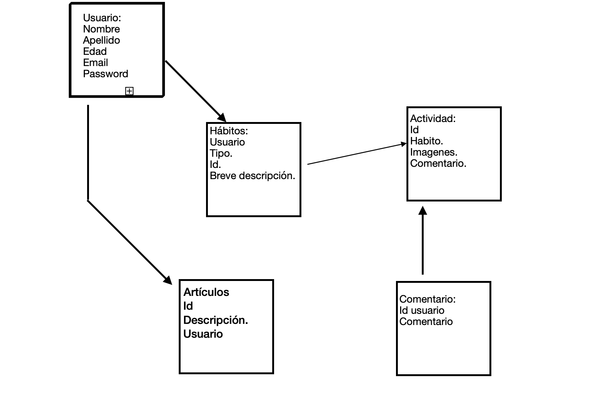

# WebPage "Mejorar Hábitos" 

## Descripción:

La Web para mejorar hábitos nace como requisito para elaborar el tercer proyecto del Bootcamp, que consiste en levantar un servidor para conectar una base de datos, crear distintos endpoints para leer, crear, actualizar y elemininar documentos en la base de datos. 

El tema de mejorar hábitos lo escogi ya que el acceso a tratamientos de salud mental en España es muy costoso, y se pronostica que 1 de cada 5 personas sufrirá problemas de salud mental; con lo cuál este proyecto, pretende que con pequeñas mejoras de nuestros hábitos diarios podamos alcanzar bienestar físico y mental.

Al acceder a la pagina web el usuario podra logearse, y escoger un plan para trabajar durante 21 días, tendrá como opciones:
* Reducir el estres.
* Ser más productivo.
* Mejorar su salud.
* Mejorar sus relaciones interpersonales. 

Al escoger un plan le saldran sugerencias de habitos a practicar, de la siguiente manera:

* Reducir el Estres:
    * Ejercicios de Respiración.
    * Meditación.
    * Dar una caminata.
    * Escribir un diario de como ha ido el día.

* Mejorar la Salud:
    * Meditar: empezar con 5 minutos al día, ir aumentando a medida que alcanza los objetivos.
    * Beber más agua. Empezar con un vaso de agua al despertar hasta beber 8 vasos al día.
    * Mejorar el sueño: comenzar con dejar de utilizar el movil 5 minutos antes de ir a la cama, ir aumentando el tiempo cuando alcance los objetivos.
    * Hacer ejercicios: tendra opción de marcar si ha realizado ejercicio Cardiovascular (caminar, correr), ejercicios de fuerza (sentadillas, planchas, etc) o estiramientos (yoga).
    * Comer más saludable: empezar por incluir frutas y vegetales en las comidas.

* Ser más produvtivo: 
    * Despertar más temprano cada día: empezar con 5 minutos antes de la hora habitual, hasta alcanzar un horario razonable.
    * Dedicar 5 minutos al día a **ordenar** el espacio de trabajo.
    * Por la noche **Planificar** las actividades del día siguiente y tiempo que llevará ejecutar cada una.
    * tomar un descanso durante el día y practicar alguna actividad física.
    * Al finalizar el día **Reflexionar** si ha cumplido los objetivos.

* Mejorar las relaciones interpersonales:
    * Llamar a un familiar o amigo: empezar por una persona una vez a la semana.
    * expresar aprecio a los seres queridos: empezar con un mensaje a una persona.
    * Planificar actividades juntos. 
    * No utilizar el movil mientras pasas tiempo con alguien. 
    * Practicar la escucha activa: enfocarse en entender el significado de lo que dice la persona. Mostrar interes y empatia. 

Una vez el usuario escoja el Habito a mejorar y la acción a realizar, que pueda marcar una vez la haya terminado, el usuario podrá escribir un comentario de como ha ido.

Tambien tendra una sección, con articulos sobre la importancia de los habitos, sugerencias de ejercicios, etc. Este apartado será manejado por el administrador. 

## Relación Entre Modelos:

## Primera fase: Backend
En esta fase desarrollamos todos los procesos necesarios para que la web funcione de manera correcta, asi como la conexion a la base de datos y el servidor.

Para lograr esto, hemos organizado las siguientes carpetas:
* **Models**: dentro de esta tenemos los siguientes _Schemas_:
1. User
2. Habits
3. Categories
4. Comentari

Luego creamos la carpeta **api** en la que empezamos a crear las  siguientes _Rutas_:
**User**
* .post(/register)- Ruta para que el usuario se registre en la web. 
Esta ruta requiere que le pasemos por el body los siguientes campos: nombre, apellido, email y password. 
Tiene como condiciones si el nombre y la contraseña son muy cortos, o alguno de los campos está vacio, resultará un error.
* .post(/login)- ruta que permite que el usuario entre en su cuenta. Cada vez que el usuario ingrese tendrá un Token. 
Esta ruta necesita que pasemos por el body el email y el passoword.
* .get (/user)- ruta para buscar usuarios 
* .get (/find/:id)- ruta para buscar usuarios por Id. Esta ruta pide que le pasemos el id del usuario por parametros
* .delete (/delete/:id) - ruta para borrar un usuario especifico buscado por el Id.
Esta ruta pide que le pasemos el id del usuario por parametros

**Categorias**
* .post(/new)- ruta para crear una categoria (se crean cuatro categorias: Reducir el estress, mejorar la salud, ser más productivo y mejorar las relaciones interpersonales). Por el body tenemos que pasarle el nombre y la descripción.
* .put(/update/:id)- ruta privada para el admin para actualizar alguna de las 4 categorias. Por paramentros les tenemos que pasar el id y la categoria.
* .get(/categories)- ruta para ver las categorias, sin necesidad de estar logueado. 
* .get(/findC/:id)- ruta privada para el administrador para buscar las categorias por id. Por parametros pasamos el id.
* .delete(/deleteCat/:id)- ruta privada para el Administrador para eliminar alguna categoria. Por parametros el id.

**Habitos**
* .post (/newHabit)- ruta privada para el administrador para crear habitos. Por el body tenemos que pasarle el nombre, la descripcion y la imagen.
* .post (/habitClient)- ruta para el usuario para generar habitos personales. Por el body nombre, descripcion e imagen.
* .get (/habit)- ruta para que el ususario pueda ver la lista de habitos.
* .get (/findH/:id)- ruta para el administrado para buscar habito por id. Por parametros pasamos el id
* .put (/updateH/:id) - ruta privada del admin para actualizar un habito. Por paramentros les tenemos que pasar el id y el habito.
* .delete(/deleteH/:id)- ruta para el admin o el usuario puedan eliminar un habito. Pasamos el id por paramentros

**Comentarios**
* .post (/newcoment)- para para que el usuario pueda agregar un comentario de feedback sobre la actividad realizada. Por el body pasamos el comentario.
* .get (/user/:coment)- ruta para que el usuario y el admin puedan ver los comentarios. Por paramentros pasamos el coment

Carpeta **middleware**: en esta carpeta tenemos dos funciones:
* auth.js 
* authAdmind.js
Estas identifican al usuario o al administrador y generan el token 

//poner en cada ruta lo que hay que pasar por el body/ parametros

